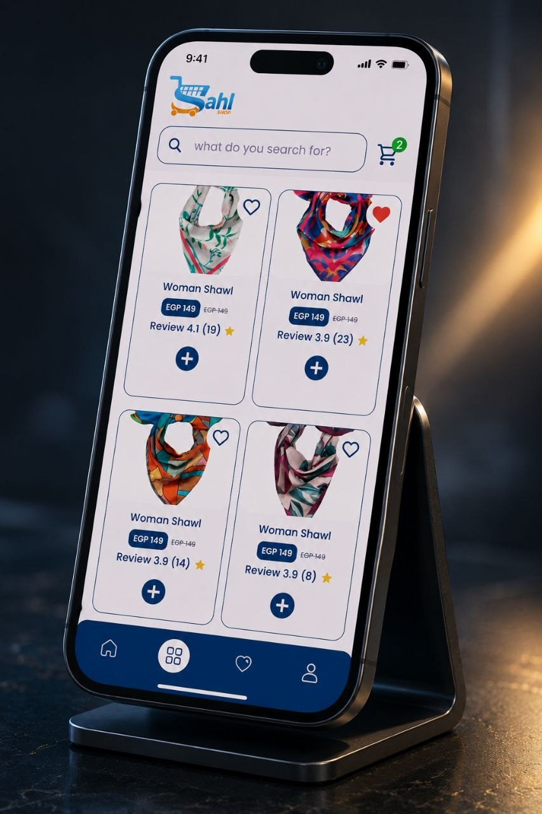

# SAHL SHOP
Modern E Commerce Flutter Application

## About The Project
SAHL SHOP is a cross platform e commerce mobile application developed using Flutter and Dart
The app provides a modern shopping experience with responsive UI product browsing cart management and API integration

## Features
Authentication System
Product Browsing
Cart Management
Responsive UI Design
REST APIs Integration
Clean Architecture
State Management Provider and BLoC
Cross Platform Support Android and iOS

## Technologies Used
Flutter
Dart
REST APIs
Clean Architecture
Provider
BLoC
Implemented Dependency Injection DI
Git and GitHub

## Architecture
The project follows Clean Architecture and Repository Pattern
UI Layer
Data Layer
Domain Layer

## Developer
Adel Sobhi Mohamed
Flutter Developer

## Screenshots
### Home Screen

### Products Screen

### App Screen

